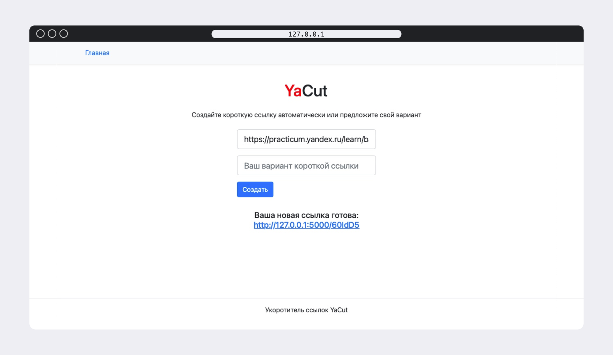

# Сервис YaCut

<p>
На большинстве сайтов адреса страниц довольно длинные, например как у той страницы, на которой вы сейчас находитесь. Делиться такими длинными ссылками не всегда удобно, а иногда и вовсе невозможно. 
Удобнее использовать короткие ссылки. Например, ссылки http://yacut.ru/lesson и http://yacut.ru/12e07d воспринимаются лучше, чем https://practicum.yandex.ru/trainer/backend-developer/lesson/12e07d96-31f3-449f-abcf-e468b6a39061/. 
Проект YaCut — это сервис укорачивания ссылок. Его назначение — ассоциировать длинную пользовательскую ссылку с короткой, которую предлагает сам пользователь или предоставляет сервис.
</p>




## Стек технологий


### Как запустить проект:

Клонировать репозиторий и перейти в него в командной строке:

```
git clone https://github.com/kateschka/yacut
```

```
cd yacut
```

Cоздать и активировать виртуальное окружение:

```
python3 -m venv venv
```

- Если у вас Linux/macOS

  ```
  source venv/bin/activate
  ```

- Если у вас windows

  ```
  source venv/scripts/activate
  ```

Установить зависимости из файла requirements.txt:

```
python3 -m pip install --upgrade pip
```

```
pip install -r requirements.txt
```

### Инициализация базы данных

```sh
flask db upgrade
```

### Запуск приложения

```sh
flask run
```

Приложение будет доступно по адресу: [http://localhost:5000](http://localhost:5000)

---

## Тестирование

Для запуска тестов используйте команду:

```sh
pytest
```

---

## Дополнительно

- Для заполнения тестовыми данными используйте команды из файла `postman_collection/set_up_data.sh`.
- Документация по API доступна в файле `openapi.yaml`.

---


## API Endpoints

### Создание короткой ссылки

```http
POST /api/id/
Content-Type: application/json

{
    "url": "https://example.com",
    "custom_id": "example"  # опционально
}
```

Успешный ответ:

```json
{
  "url": "https://example.com",
  "short_link": "http://localhost:5000/example"
}
```

### Получение оригинальной ссылки

```http
GET /api/id/{short_id}/
```

Успешный ответ:

```json
{
  "url": "https://example.com"
}
```

### Коды ответов

- 200 - Успешный запрос
- 201 - Ссылка успешно создана
- 400 - Ошибка валидации
- 404 - Ссылка не найдена

### Ограничения

- Максимальная длина короткой ссылки: 16 символов
- Короткая ссылка может содержать только латинские буквы и цифры
- Если custom_id не указан, генерируется случайная строка длиной 6 символов
